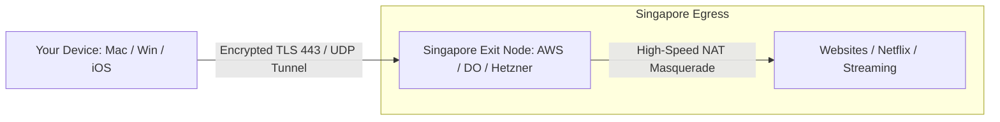

# Tunneling to Singapore with AnonymousAnt 🇸🇬

This guide explains how tunneling to Singapore works and provides a 5-minute setup guide to deploy an AnonymousAnt Exit Node in Singapore.

---

## 1. How Tunneling to Singapore Works

A VPN routes your encrypted internet traffic from your current location (e.g. US, UK, home, or coffee shop) to a remote server (the **Exit Node**). 
To have a Singapore IP address, your exit node must reside in a Singapore datacenter.



When you connect:
1. Your client device encrypts all internet packets and wraps them in **Port 443 Chameleon TLS 1.3** (or Noise UDP).
2. The packets travel across the ocean to the Singapore server.
3. The Singapore server decrypts the packets, applies **IPv4 NAT Masquerading**, and forwards them to the public internet.
4. All websites and services see the request originating from Singapore (`Country: Singapore (SG)`).
5. Responses return to the Singapore server, are encrypted, and sent back to your device.

---

## 2. 5-Minute Setup: Deploying in Singapore

### Option A: Any Cloud VPS in Singapore (Recommended)
You can use any cloud provider that has a Singapore region (e.g., **DigitalOcean** `SGP1`, **AWS** `ap-southeast-1`, **Hetzner** Singapore, **Linode/Akamai** Singapore, or **Oracle Cloud** Singapore).

1. Create a basic Ubuntu 22.04 / 24.04 droplet/instance in the **Singapore** region ($4–$5/month).
2. SSH into the server:
   ```bash
   ssh root@<YOUR_SINGAPORE_SERVER_IP>
   ```
3. Run the automated 1-command installer:
   ```bash
   curl -sSL https://raw.githubusercontent.com/chengyaolee/AnonymousAnt/main/deploy/singapore/setup.sh | sudo bash
   ```
4. View your connection string from the server output:
   ```bash
   journalctl -u anonymousant-server -n 20 --no-pager
   ```
   You will see:
   ```text
   ==================================================================
    Server Public Key:  m-XQ_4W5rXJ8yD...
    Connection String:  ant://m-XQ_4W5rXJ8yD...@<SG_SERVER_IP>:8443?obfs=tls
   ==================================================================
   ```

---

### Option B: Docker Deployment
If your Singapore server already runs Docker:
```bash
git clone https://github.com/chengyaolee/AnonymousAnt.git
cd AnonymousAnt/deploy/singapore
docker compose up -d
docker logs antserver-sg
```

---

## 3. Connecting to your Singapore Exit Node

### Method 1: Desktop GUI (`ant-ui`)
1. Make sure `ant-daemon` is running in your terminal:
   ```bash
   sudo ./bin/ant-daemon
   ```
2. Launch `ant-ui`:
   ```bash
   ./bin/ant-ui
   ```
3. In the UI, paste your `ant://...` connection string into the **Connection URL** field.
4. Click **CONNECT**!

### Method 2: Command-Line (`antclient`)
Run the client with the Singapore URL and enable routing:
```bash
sudo ./bin/antclient \
  -url "ant://<SG_PUBKEY>@<SG_SERVER_IP>:8443?obfs=tls" \
  -routes
```

### Method 3: iOS (iPhone / iPad)
1. Open the AnonymousAnt iOS app.
2. Paste the `ant://...` URL or scan the QR code.
3. Tap **CONNECT**.

---

## 4. Verifying Your Location
Once connected, open a terminal or browser and verify your geolocation:
```bash
curl https://ipinfo.io
```
Expected Output:
```json
{
  "ip": "<YOUR_SINGAPORE_SERVER_IP>",
  "city": "Singapore",
  "region": "Singapore",
  "country": "SG",
  "loc": "1.2897,103.8501",
  "org": "DigitalOcean, LLC / Amazon.com, Inc."
}
```
You are now securely tunneling all traffic through Singapore!
